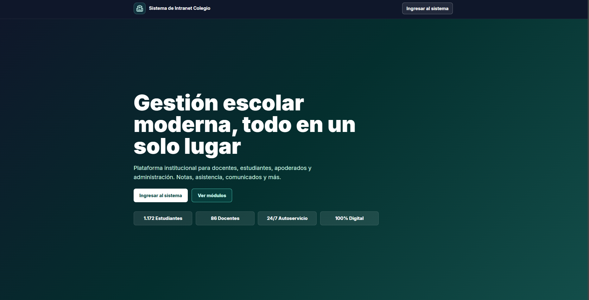
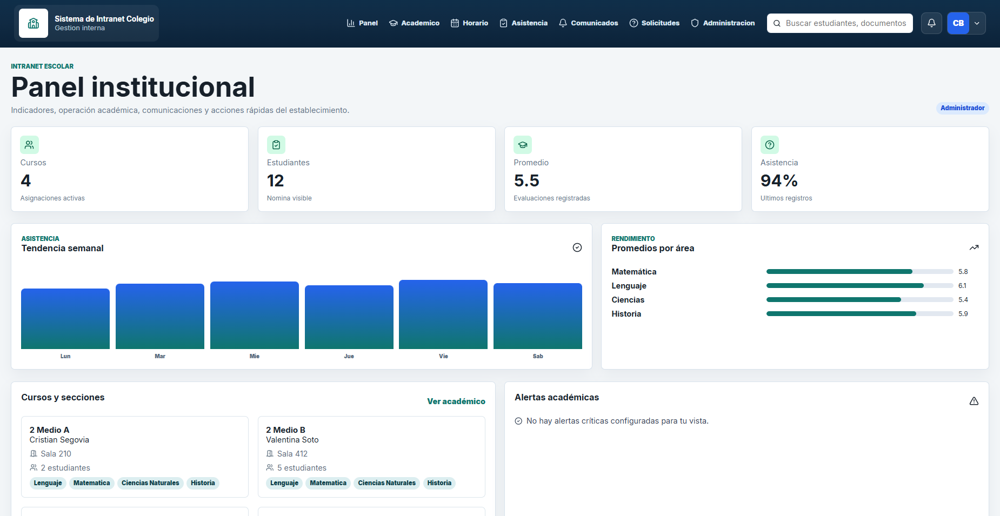
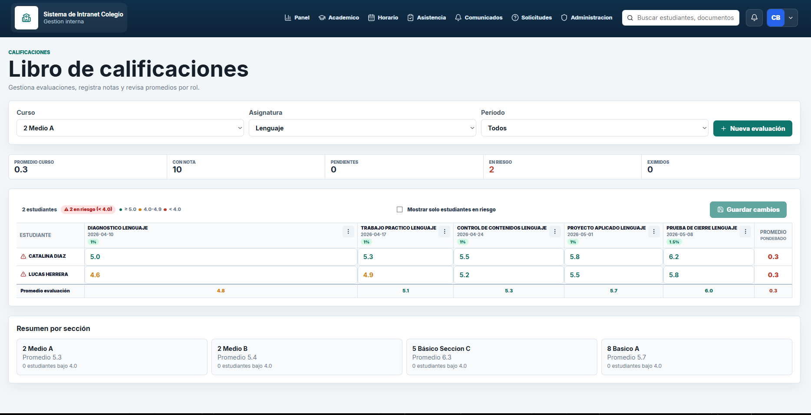
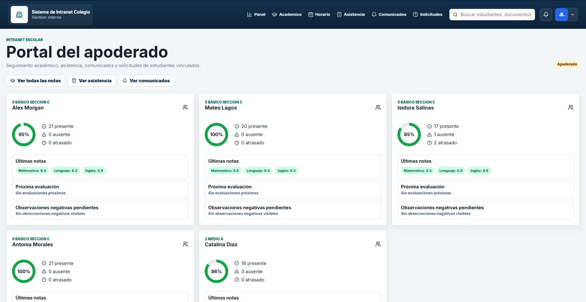
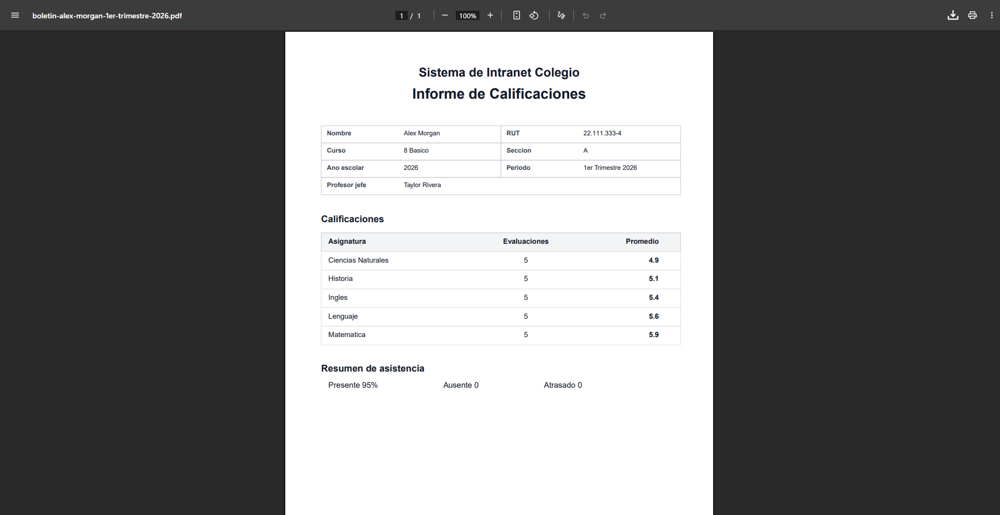

# Sistema de Intranet Escolar

Plataforma de gestión académica institucional para colegios. Incluye gestión de notas, asistencia, comunicados, tickets administrativos, horarios, notificaciones en tiempo real y generación de boletines PDF.

## Vista previa

| Landing institucional | Panel administrativo |
|----------------------|---------------------|
|  |  |

| Libro de calificaciones | Portal del apoderado |
|------------------------|---------------------|
|  |  |

| Boletín PDF |
|-------------|
|  |

## Stack técnico

| Capa | Tecnología |
|------|-----------|
| Frontend | React 18 + TypeScript + Vite |
| Backend | Node.js + Express + TypeScript |
| ORM | Prisma |
| Base de datos | MySQL / MariaDB |
| Autenticación | JWT + Refresh Tokens |
| Tiempo real | Server-Sent Events (SSE) |
| PDF | PDFKit |
| Contenedores | Docker Compose |

## Roles del sistema

| Rol | Acceso principal |
|-----|----------------|
| Administrador | Gestión total de usuarios, estructura escolar y auditoría |
| Director | Supervisión académica y reportes institucionales |
| Inspector | Control de asistencia y tickets |
| Docente | Libro de calificaciones, asistencia y materiales |
| Estudiante | Portal personal con notas, horario y comunicados |
| Apoderado | Seguimiento académico de hijos vinculados |

## Módulos implementados

- **Autenticación** — Login, refresh tokens, recuperación de contraseña por email
- **Panel institucional** — Dashboard diferenciado por rol con indicadores en tiempo real
- **Libro de calificaciones** — Evaluaciones con peso, bulk upsert, promedio ponderado y alertas
- **Asistencia** — Registro diario por sección/asignatura con tendencia semanal
- **Horario institucional** — Vista por bloques con detección de conflictos
- **Comunicados** — Mensajes segmentados por rol con tracking de lectura real
- **Tickets administrativos** — Solicitudes con comentarios, historial de estados y notificaciones
- **Períodos académicos** — Trimestres/semestres con filtro en el gradebook
- **Anotaciones de estudiantes** — Observaciones positivas/negativas/neutrales con notificación
- **Portal del apoderado** — Vista consolidada de notas y asistencia por hijo/a
- **Boletín PDF** — Informe de calificaciones descargable por período
- **Notificaciones SSE** — Push en tiempo real sin WebSocket
- **Auditoría** — Log de acciones críticas con IP, userAgent y filtros
- **Administración** — CRUD de usuarios, estudiantes, profesores, cursos, secciones, salas y horarios
- **Materiales** — Unidades, materiales y tareas por asignatura

## Cómo levantar el proyecto localmente

### Requisitos
- Node.js 20+
- Docker y Docker Compose

### Pasos

```bash
# 1. Clonar el repositorio
git clone https://github.com/tu-usuario/school-intranet-system.git
cd school-intranet-system

# 2. Configurar variables de entorno
cp server/.env.example server/.env
# Editar server/.env con tus valores

# 3. Levantar la base de datos
docker compose up -d

# 4. Instalar dependencias
cd server && npm install
cd ../client && npm install

# 5. Ejecutar migraciones
cd ../server && npx prisma migrate deploy

# 6. Cargar datos de demostración
npx prisma db seed

# 7. Iniciar servidores de desarrollo
# Terminal 1 (backend):
cd server && npm run dev

# Terminal 2 (frontend):
cd client && npm run dev
```

La aplicación estará disponible en http://localhost:5173

## Credenciales demo

Todos los usuarios usan la contraseña: `demo1234`

| Rol | Email |
|-----|-------|
| Administrador | admin@school-intranet.test |
| Director | director@school-intranet.test |
| Inspector | inspector@school-intranet.test |
| Docente | teacher@school-intranet.test |
| Estudiante | student@school-intranet.test |
| Apoderado | guardian@school-intranet.test |

## Arquitectura backend
Cliente React
│
▼ HTTP REST
Express Router
│
▼
Controller  ←  valida con Zod
│
▼
Service     ←  lógica de negocio + permisos
│
▼
Repository  ←  queries Prisma
│
▼
MySQL / MariaDB

## Seguridad

- JWT access token (15min) + refresh token (7 días) con rotación
- Tokens hasheados en base de datos
- Rate limiting: 100 req/15min global, 10 req/15min en endpoints de auth
- Helmet para headers de seguridad HTTP
- Auditoría de LOGIN_SUCCESS, LOGIN_FAILED y acciones críticas con IP, userAgent y filtros

## Testing

El proyecto incluye tests de integración con Vitest + Supertest.
Para ejecutar los tests:

```bash
cd server && npm test
```

Cobertura actual:
- Auth: login exitoso/fallido, rutas protegidas
- Permisos: RBAC por rol (admin, estudiante)
- Health check

## Roadmap

- [x] Tests de integración para flujos críticos (login, asistencia, calificaciones)
- [x] Separación de AdminPage.tsx en componentes por módulo
- [x] Export de datos académicos en formato CSV
- [x] FullCalendar para vista de horario semanal
- [x] Design system con CSS variables
- [ ] Refactor de styles.css por dominio (base, layout, forms, admin, gradebook)
- [ ] Firma digital de comunicados por apoderado
- [ ] Integración con calendario externo

---
